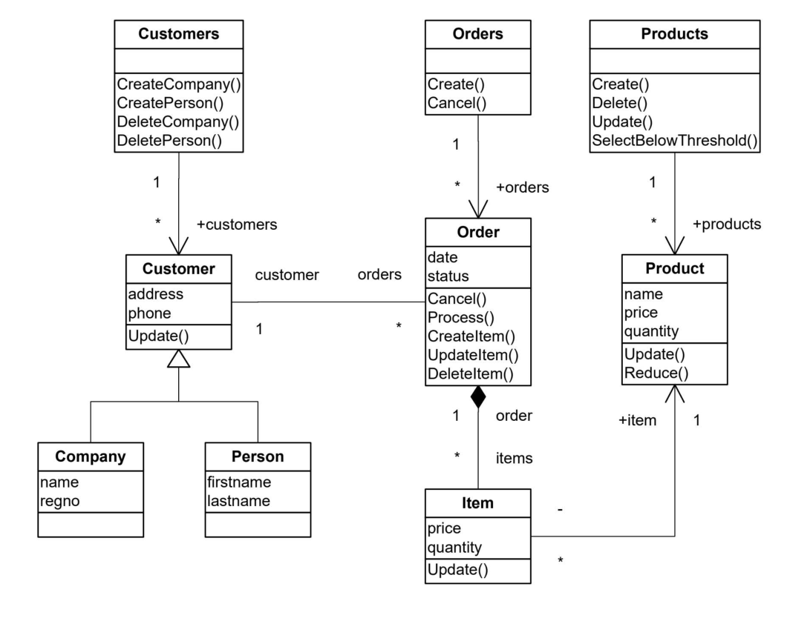

# UML diagram to code issues

## Objective

Turn this UML diagram into code.



## First attempt

Everything has little red icon warning about package issue. Why?

## directory setup 1

correct: ProjectName > Homework > src > *.java
mine: ProjectName > src > defailt > *.java

I should right click on src > new class. Not sure what I did the first time around.

## directory setup 2

Create folder Homework > src?

## GUI issue

When I try to create a new java class (right click > New > Class > Customer), it automatically creates a package module. Not seeing how to simply create a .java file (other than new > file).

## Keyword reminders

### Public Private

Why did we make Customers.java public vector, not private vector, like the other attributes?

Public makes it so that any code can access it, but dont you want all private by default, and access via getters/setters?

`public static void`

### static

statis is so that you don't need an instance of the class to access it (pg 282). e.g. Math

```java
public class Orders {
    public void Create() {		
    }
    public void Cancel() {		
	}
}
```

### abstract

public **abstract** class. Abstract prevents anyone from instantiating that class. e.g. parent class is Animal, and subclasses are Bird, Dog, and you only want people to instantiate subclasses, so abstract the Animal class.

`public abstract void`

### void

allows us to create methods which do not return a value

```java
public String getName() {
    return name;
}
public void setName(String name) {
    this.name = name;
}
```

